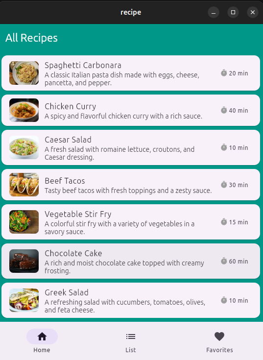
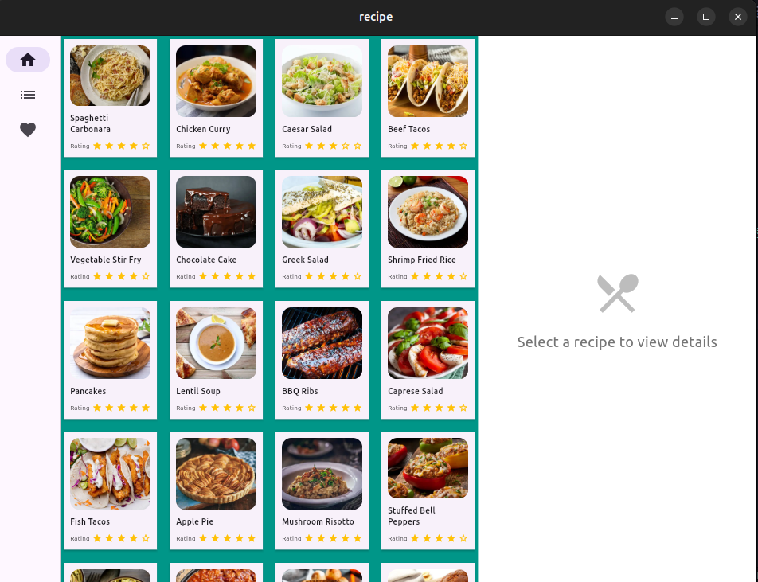
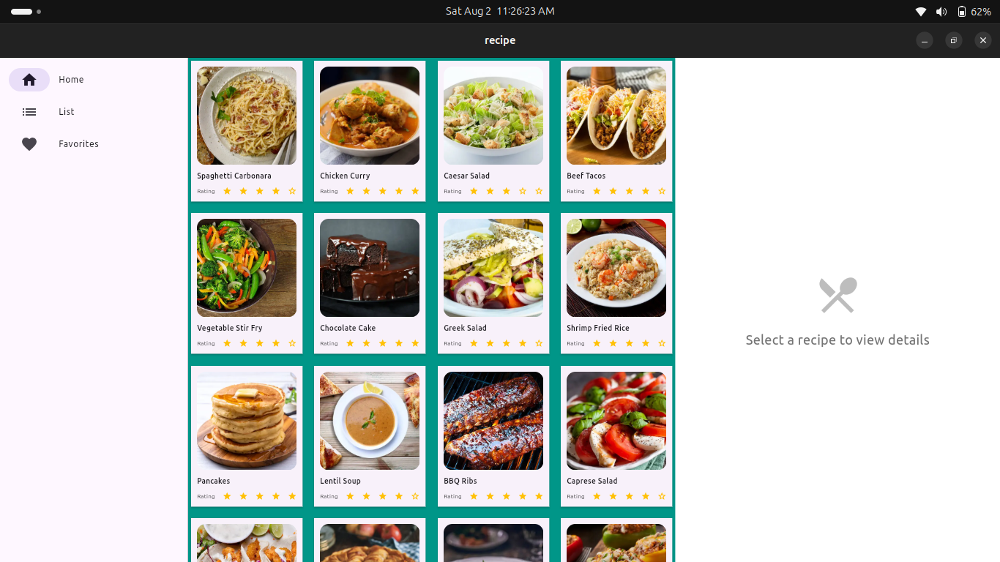

# Recipe App 🍳

A responsive Flutter application built for the CompileCamp Flutter Bootcamp that allows users to browse, search, and manage their favorite recipes across different devices.

## 🌐 Live Demo

**Try the app live:** [Recipe App Demo](https://recipe-knvwqnw-ayikoandrew.globeapp.dev)

*Experience the responsive design across different screen sizes by resizing your browser window!*


## Features ✨

- **Responsive Design**: Adapts seamlessly to mobile, tablet, and desktop screens
- **Recipe Browsing**: Browse through a collection of 50+ recipes with images
- **Search & Filter**: Search recipes by name, ingredients, or tags with category filters
- **Recipe Details**: View detailed recipe information including ingredients, instructions, cook time, and ratings
- **Favorites Management**: Add/remove recipes to/from favorites with persistent storage
- **Multi-Platform Navigation**: 
  - Mobile: Bottom navigation + drawer
  - Tablet: Navigation rail (collapsed)
  - Desktop: Navigation rail (extended)

## Screenshots 📱

| Mobile View | Tablet View | Desktop View |
|-------------|-------------|--------------|
|  |  |  |

## Getting Started 🚀

### Prerequisites

- Flutter SDK (version 3.0 or higher)
- Dart SDK
- Android Studio / VS Code
- Git

### Installation

1. **Clone the repository**
   ```bash
   git clone https://github.com/Ayikoandrew/recipe.git
   cd recipe

[def]: screenshots/desktop.png